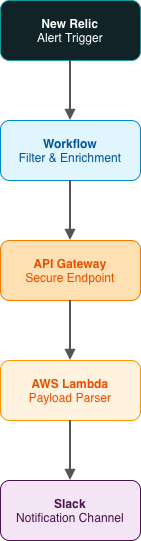
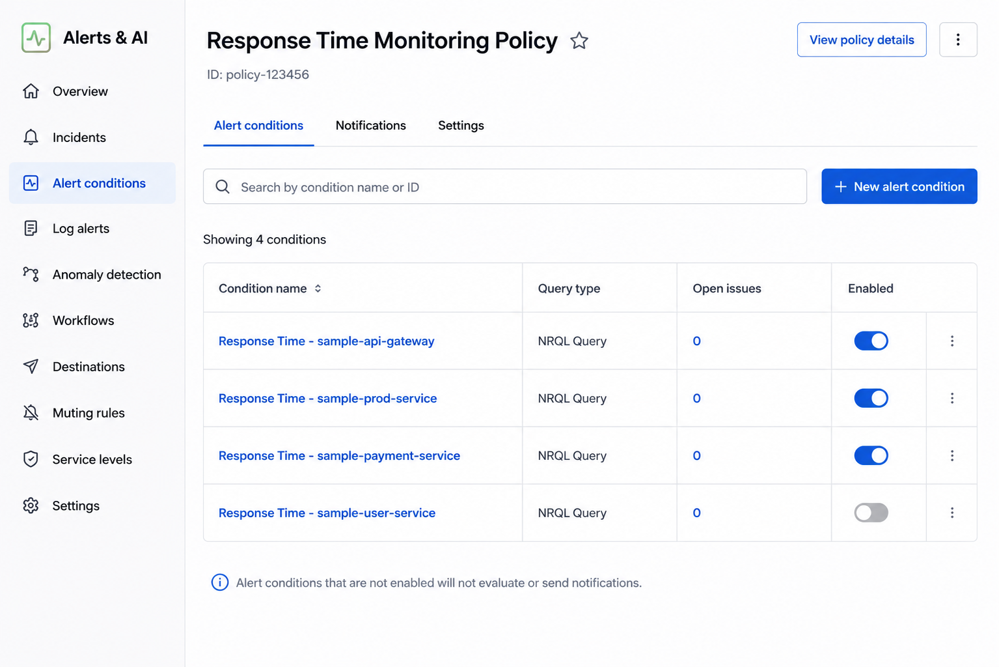
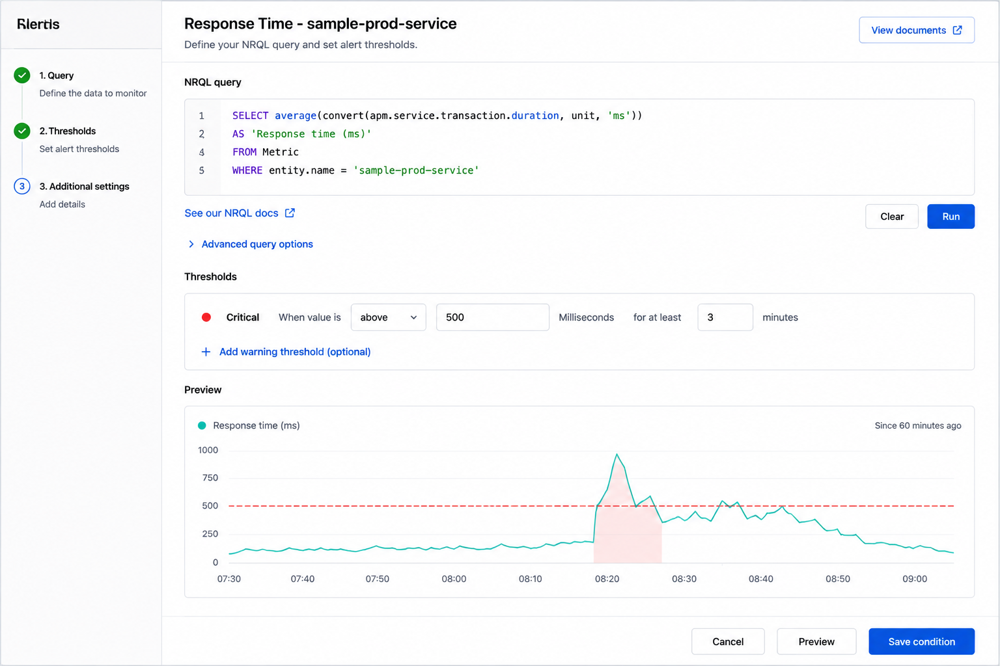
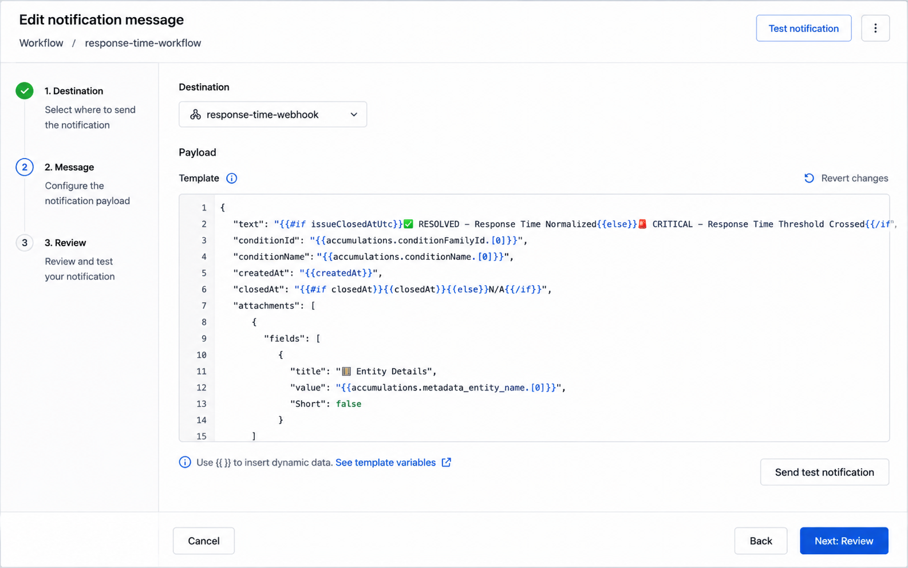
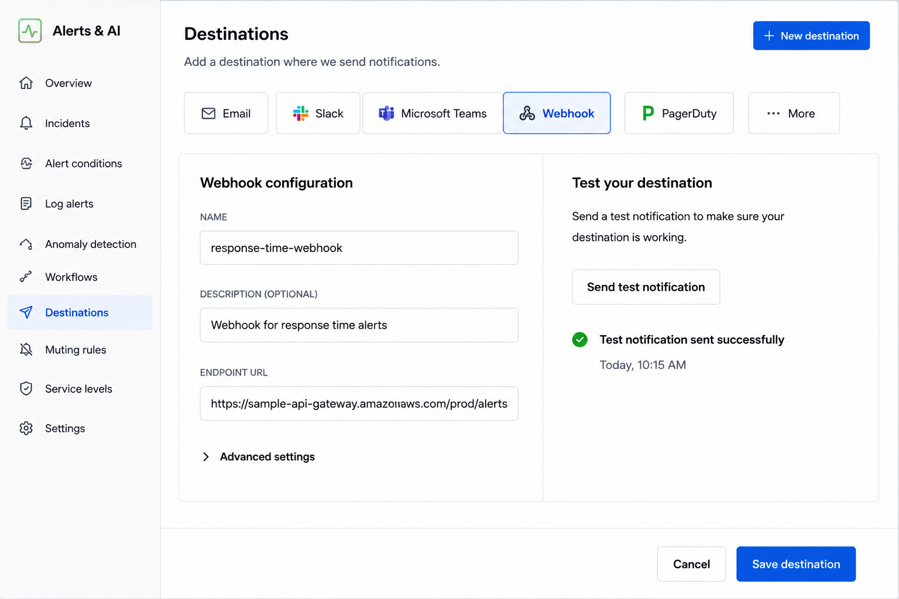
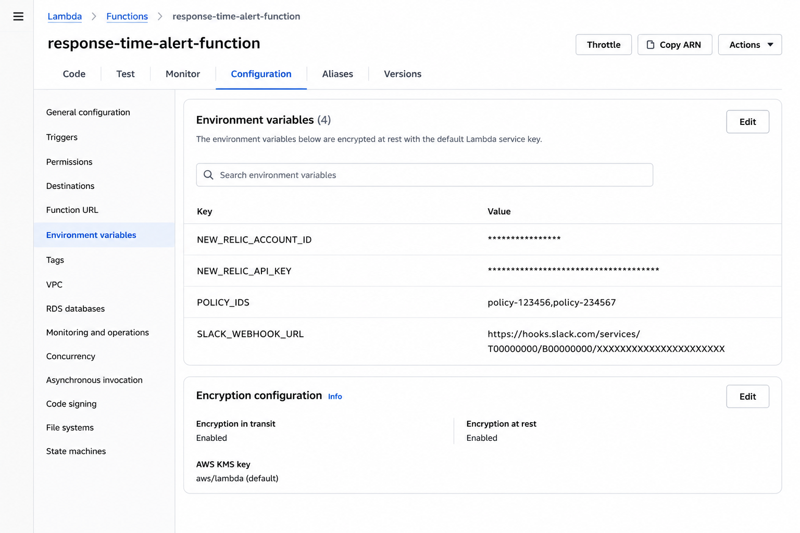
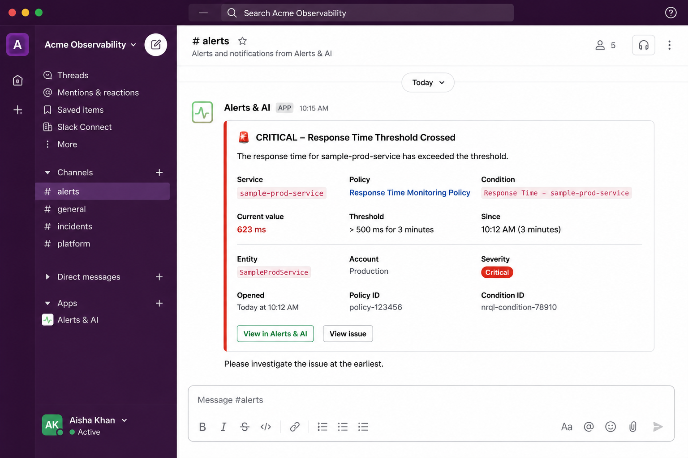

# 🚀 New Relic Response Time Alerting


## 📌 Overview

This project implements a production-grade response time monitoring solution using:

* New Relic APM
* NRQL Alert Conditions
* New Relic Workflows
* AWS Lambda
* AWS API Gateway
* Slack Webhooks

The solution automatically detects response time threshold breaches, enriches alert information using New Relic GraphQL APIs, and sends actionable notifications to Slack.

---

## 🏗️ Architecture



### Alert Flow

```text
New Relic APM
      │
      ▼
NRQL Alert Condition
      │
      ▼
New Relic Workflow
      │
      ▼
API Gateway
      │
      ▼
AWS Lambda
      │
      ▼
Slack Channel
```

---

# 📚 Table of Contents

* Overview
* Architecture
* Features
* Repository Structure
* Screenshots
* NRQL Query
* Environment Variables
* Setup Guide
* Workflow Payload
* Lambda Processing
* Testing
* Troubleshooting
* Future Enhancements
* Resume Project Description

---

# ✨ Features

✅ Response Time Monitoring

✅ Automated Incident Notifications

✅ Slack Alerting

✅ Dynamic Threshold Lookup

✅ New Relic GraphQL Integration

✅ AWS Lambda Alert Enrichment

✅ API Gateway Integration

✅ Incident Opened Notifications

✅ Incident Resolved Notifications

✅ IST Time Conversion

✅ Quiet Hours Support

✅ Chart Visualization Support

---

# 📂 Repository Structure

```text
newrelic-response-time-alerting
│
├── README.md
│
├── assets
│   └── architecture-diagram.png
│
├── docs
│   ├── architecture.md
│   ├── setup-guide.md
│   ├── troubleshooting.md
│   └── workflow-payload.md
│
├── lambda
│   └── lambda_function.py
│
└── screenshots
    ├── policy.png
    ├── nrql-condition.png
    ├── workflow.png
    ├── destination.png
    ├── lambda-env.png
    └── slack-alert.png
```

---

# 📸 Screenshots

## 1️⃣ Alert Policy



---

## 2️⃣ NRQL Alert Condition



---

## 3️⃣ Workflow Configuration



---

## 4️⃣ Webhook Destination



---

## 5️⃣ Lambda Environment Variables



---

## 6️⃣ Slack Alert Notification



---

# 📈 NRQL Query

```sql
SELECT average(convert(apm.service.transaction.duration, unit, 'ms'))
AS 'Response time (ms)'
FROM Metric
WHERE entity.name = 'sample-prod-service'
```

---

# 🔐 Environment Variables

| Variable             | Description            |
| -------------------- | ---------------------- |
| NEW_RELIC_ACCOUNT_ID | New Relic Account ID   |
| NEW_RELIC_API_KEY    | New Relic User API Key |
| POLICY_IDS           | Alert Policy IDs       |
| SLACK_WEBHOOK_URL    | Slack Incoming Webhook |
| QUIET_HOURS_START    | Quiet Hours Start Time |
| QUIET_HOURS_END      | Quiet Hours End Time   |

Example:

```env
NEW_RELIC_ACCOUNT_ID=123456
NEW_RELIC_API_KEY=NRAK-XXXXXXXXXXXXXXXX
POLICY_IDS=12345,67890
SLACK_WEBHOOK_URL=https://hooks.slack.com/services/xxxx/yyyy/zzzz
QUIET_HOURS_START=00:00
QUIET_HOURS_END=06:00
```

---

# ⚙️ Setup Guide

## Step 1 – Create Slack Channel

Create a dedicated Slack channel.

Example:

```text
#production-alerts
```

Generate an Incoming Webhook URL.

---

## Step 2 – Create New Relic Policy

Navigate to:

```text
Alerts & AI
→ Policies
→ Create Policy
```

---

## Step 3 – Create NRQL Alert Condition

Configure:

```text
Critical Threshold:
Above 500 ms
For at least 3 minutes
```

---

## Step 4 – Create Destination

Navigate:

```text
Alerts & AI
→ Destinations
→ Webhook
```

Use API Gateway endpoint.

---

## Step 5 – Create Workflow

Associate:

* Alert Policy
* Webhook Destination

Configure custom payload.

---

## Step 6 – Deploy Lambda

Deploy:

```text
lambda/lambda_function.py
```

Configure environment variables.

---

## Step 7 – Create API Gateway

Create:

```text
HTTP API
```

Method:

```text
POST
```

Integration:

```text
AWS Lambda
```

---

# 🔄 Lambda Processing

Lambda performs:

1. Receives webhook payload
2. Extracts alert details
3. Retrieves condition information
4. Queries New Relic GraphQL APIs
5. Retrieves threshold details
6. Converts timestamps to IST
7. Applies Quiet Hours logic
8. Builds Slack message
9. Sends notification to Slack

---

# 🧪 Testing

Trigger a test notification from:

```text
New Relic Workflow
→ Test Notification
```

Verify:

* API Gateway receives request
* Lambda execution succeeds
* Slack notification is delivered

---

# 🛠 Troubleshooting

### Slack Notification Not Received

Verify:

* Slack Webhook URL
* Lambda Logs
* API Gateway Integration

---

### Condition Name Not Available

Verify:

* API Key Permissions
* Account ID
* Policy IDs

---

### Workflow Not Triggering

Verify:

* Workflow enabled
* Policy linked
* Condition enabled

---

### Lambda Timeout

Increase timeout to:

```text
30 Seconds
```

---

# 🚀 Future Enhancements

* Microsoft Teams Integration
* Email Notifications
* PagerDuty Integration
* ServiceNow Incident Creation
* Multi-Region Alert Routing
* Dashboard Automation
* Alert Analytics

---

# 💼 Resume Project Description

### New Relic Response Time Monitoring & Alert Automation

Designed and implemented an end-to-end monitoring solution using New Relic APM, NRQL alert conditions, AWS Lambda, API Gateway, and Slack. Automated response-time threshold breach detection, enriched alert payloads through New Relic GraphQL APIs, and delivered real-time incident notifications with threshold, entity, chart, and incident details. Implemented quiet-hours filtering and incident resolution workflows to improve operational visibility and reduce Mean Time to Resolution (MTTR).

### Technologies Used

* New Relic
* NRQL
* AWS Lambda
* API Gateway
* Python
* Slack Webhooks
* GraphQL
* Monitoring & Observability
* Incident Management

---

## ⭐ If you found this project useful, consider giving it a star.
