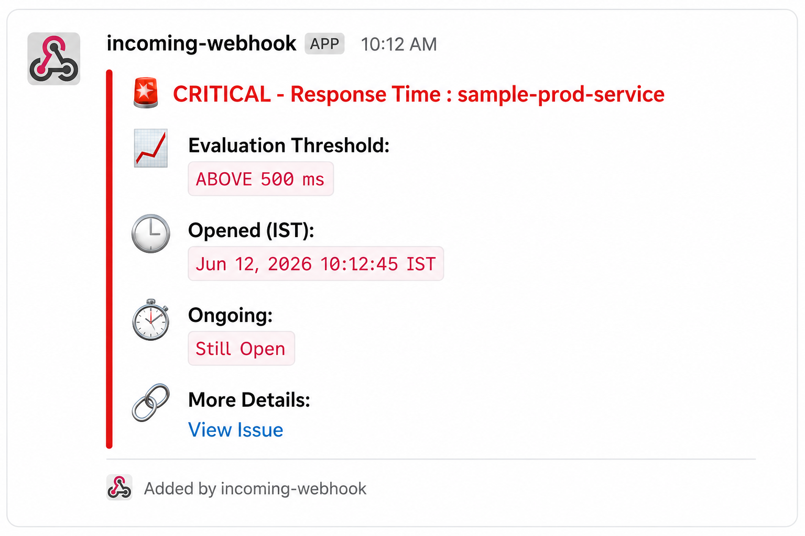
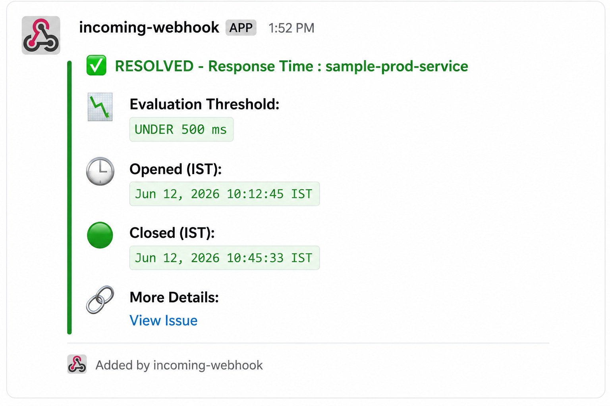

# 🚀 New Relic Response Time Alerting


## 📌 Overview

This project implements a production-grade Response Time Monitoring solution using New Relic, AWS Lambda, API Gateway, and Slack.

The solution continuously monitors application response times using NRQL alert conditions. Whenever a configured threshold is breached, New Relic triggers a workflow that invokes AWS Lambda through API Gateway. Lambda enriches the alert with additional metadata and sends a formatted notification to Slack.

The solution also supports automatic incident resolution notifications, providing complete visibility into the incident lifecycle.

### Technologies Used

* New Relic APM
* NRQL Alert Conditions
* New Relic Workflows
* AWS Lambda
* AWS API Gateway
* Slack Webhooks
* GraphQL APIs
* Python

---

# 🏗️ Architecture


## Alert Flow

```text
New Relic APM
      │
      ▼
NRQL Alert Condition
      │
      ▼
New Relic Workflow
      │
      ▼
AWS API Gateway
      │
      ▼
AWS Lambda
      │
      ▼
Slack Channel
```

### Architecture Overview

1. New Relic monitors application response times.
2. NRQL alert conditions evaluate response time thresholds.
3. New Relic Workflow triggers a webhook notification.
4. API Gateway receives the webhook request.
5. Lambda enriches the alert using New Relic GraphQL APIs.
6. Lambda formats the notification payload.
7. Slack receives Open or Resolved incident notifications.

---

# 📚 Table of Contents

* Overview
* Architecture
* Features
* Repository Structure
* Screenshots
* NRQL Query
* Environment Variables
* Setup Guide
* Lambda Processing
* Incident Lifecycle
* Testing
* Troubleshooting
* Future Enhancements
* Resume Project Description

---

# ✨ Features

✅ Response Time Monitoring

✅ Automated Incident Detection

✅ Open Incident Notifications

✅ Incident Resolution Notifications

✅ Complete Incident Lifecycle Tracking

✅ Slack Alerting

✅ Dynamic Threshold Lookup

✅ New Relic GraphQL Integration

✅ AWS Lambda Alert Enrichment

✅ API Gateway Integration

✅ IST Time Conversion

✅ Quiet Hours Support

✅ Chart Visualization Support

✅ Production-Ready Monitoring Workflow

---

# 📂 Repository Structure

```text
newrelic-response-time-alerting
│
├── README.md
│
├── .gitignore
├── .env.example
│
├── assets
│   └── architecture-diagram.png
│
├── docs
│   ├── architecture.md
│   ├── setup-guide.md
│   ├── troubleshooting.md
│   └── workflow-payload.md
│
├── lambda
│   └── lambda_function.py
│
└── screenshots
    ├── policy.png
    ├── nrql-condition.png
    ├── workflow.png
    ├── destination.png
    ├── lambda-env.png
    ├── slack-alert-open.png
    └── slack-alert-resolved.png
```

---

# 📸 Screenshots

## 1️⃣ Alert Policy

Response Time monitoring policy containing multiple NRQL alert conditions.


---

## 2️⃣ NRQL Alert Condition

NRQL query configured to monitor application response time and trigger incidents when thresholds are breached.


---

## 3️⃣ Workflow Configuration

New Relic Workflow configured to send webhook notifications to AWS API Gateway.


---

## 4️⃣ Webhook Destination

Webhook destination used by New Relic to invoke the API Gateway endpoint.


---

## 5️⃣ Lambda Environment Variables

Environment variables used by AWS Lambda for New Relic API access and Slack integration.


---

## 6️⃣ Open Incident Notification

Slack notification generated when application response time exceeds the configured threshold.

The incident remains active until the response time returns below the defined threshold.



---

## 7️⃣ Resolved Incident Notification

Slack notification automatically generated when application response time returns to normal and the incident is resolved.

This provides complete visibility into the incident lifecycle.



---

# 📈 NRQL Query

```sql
SELECT average(convert(apm.service.transaction.duration, unit, 'ms'))
AS 'Response time (ms)'
FROM Metric
WHERE entity.name = 'sample-prod-service'
```

---

# 🔐 Environment Variables

| Variable             | Description                |
| -------------------- | -------------------------- |
| NEW_RELIC_ACCOUNT_ID | New Relic Account ID       |
| NEW_RELIC_API_KEY    | New Relic User API Key     |
| POLICY_IDS           | Alert Policy IDs           |
| SLACK_WEBHOOK_URL    | Slack Incoming Webhook URL |
| QUIET_HOURS_START    | Quiet Hours Start Time     |
| QUIET_HOURS_END      | Quiet Hours End Time       |

Example:

```env
NEW_RELIC_ACCOUNT_ID=123456
NEW_RELIC_API_KEY=NRAK-XXXXXXXXXXXXXXXX
POLICY_IDS=12345,67890
SLACK_WEBHOOK_URL=https://hooks.slack.com/services/xxx/yyy/zzz
QUIET_HOURS_START=00:00
QUIET_HOURS_END=06:00
```

---

# ⚙️ Setup Guide

## Step 1 – Create Slack Channel

Create a dedicated Slack channel for monitoring alerts.

Example:

```text
#production-alerts
```

Generate an Incoming Webhook URL.

---

## Step 2 – Create New Relic Policy

Navigate to:

```text
Alerts & AI
→ Policies
→ Create Policy
```

Create:

```text
Response Time Monitoring Policy
```

---

## Step 3 – Create NRQL Alert Condition

Configure the following NRQL query:

```sql
SELECT average(convert(apm.service.transaction.duration, unit, 'ms'))
AS 'Response time (ms)'
FROM Metric
WHERE entity.name = 'sample-prod-service'
```

Configure threshold:

```text
Critical:
Above 500 ms
For at least 3 minutes
```

---

## Step 4 – Create Webhook Destination

Navigate to:

```text
Alerts & AI
→ Destinations
→ Webhook
```

Configure API Gateway endpoint.

---

## Step 5 – Create Workflow

Associate:

* Alert Policy
* Webhook Destination

Configure custom JSON payload.

---

## Step 6 – Deploy Lambda

Deploy:

```text
lambda/lambda_function.py
```

Configure environment variables.

---

## Step 7 – Create API Gateway

Create:

```text
HTTP API
```

Method:

```text
POST
```

Integration:

```text
AWS Lambda
```

---

# 🔄 Lambda Processing

Lambda performs the following actions:

1. Receives webhook payload from New Relic.
2. Extracts incident metadata.
3. Retrieves condition information.
4. Queries New Relic GraphQL APIs.
5. Retrieves threshold details.
6. Converts timestamps to IST.
7. Determines incident state.
8. Applies quiet-hours logic.
9. Builds Slack notification payload.
10. Sends notification to Slack.

---

# 🚨 Incident Lifecycle

The solution supports complete incident lifecycle management.

## Incident Opened

```text
Response Time > Threshold
        │
        ▼
New Relic Incident Created
        │
        ▼
Slack Open Alert Notification
```

## Incident Resolved

```text
Response Time Returns to Normal
        │
        ▼
New Relic Incident Closed
        │
        ▼
Slack Resolved Notification
```

This ensures support teams are notified when an issue begins and when it has been successfully resolved.

---

# 🧪 Testing

Trigger a test notification from:

```text
New Relic Workflow
→ Test Notification
```

Verify:

* API Gateway receives the request.
* Lambda executes successfully.
* Slack notification is delivered.
* Alert details are enriched correctly.

---

# 🛠 Troubleshooting

## Slack Notification Not Received

Verify:

* Slack Webhook URL
* Lambda Logs
* API Gateway Endpoint
* Workflow Configuration

---

## Condition Name Not Available

Verify:

* NEW_RELIC_API_KEY
* NEW_RELIC_ACCOUNT_ID
* POLICY_IDS

---

## Workflow Not Triggering

Verify:

* Workflow is enabled.
* Policy is linked.
* Condition is enabled.

---

## Lambda Timeout

Increase timeout to:

```text
30 Seconds
```

---

## API Gateway Errors

Verify:

* Lambda permissions
* Integration request mapping
* Deployment stage configuration

---

# 🚀 Future Enhancements

* Microsoft Teams Integration
* Email Notifications
* PagerDuty Integration
* ServiceNow Incident Creation
* Multi-Region Alert Routing
* Dashboard Automation
* Alert Analytics
* Auto Remediation Workflows

---

# 💼 Resume Project Description

## New Relic Response Time Monitoring & Alert Automation

Designed and implemented an end-to-end application performance monitoring solution using New Relic APM, NRQL alert conditions, AWS Lambda, API Gateway, and Slack. Automated response-time threshold breach detection, enriched alert payloads through New Relic GraphQL APIs, and delivered real-time incident notifications with threshold, entity, chart, and incident details. Implemented incident lifecycle tracking with both Open and Resolved alerts, threshold enrichment, IST time conversion, and quiet-hours support to improve operational visibility and reduce Mean Time to Resolution (MTTR).

### Technologies Used

* New Relic
* NRQL
* AWS Lambda
* API Gateway
* Python
* Slack Webhooks
* GraphQL
* Monitoring & Observability
* Incident Management

---

## ⭐ If you found this project useful, consider giving it a star.
